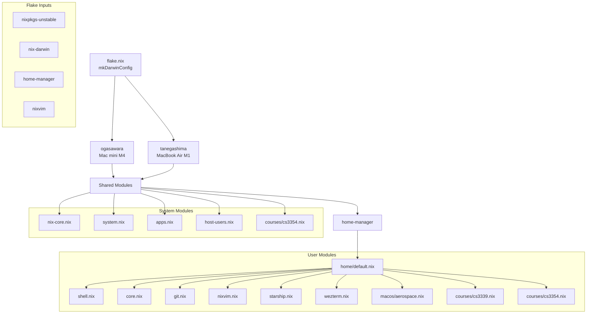
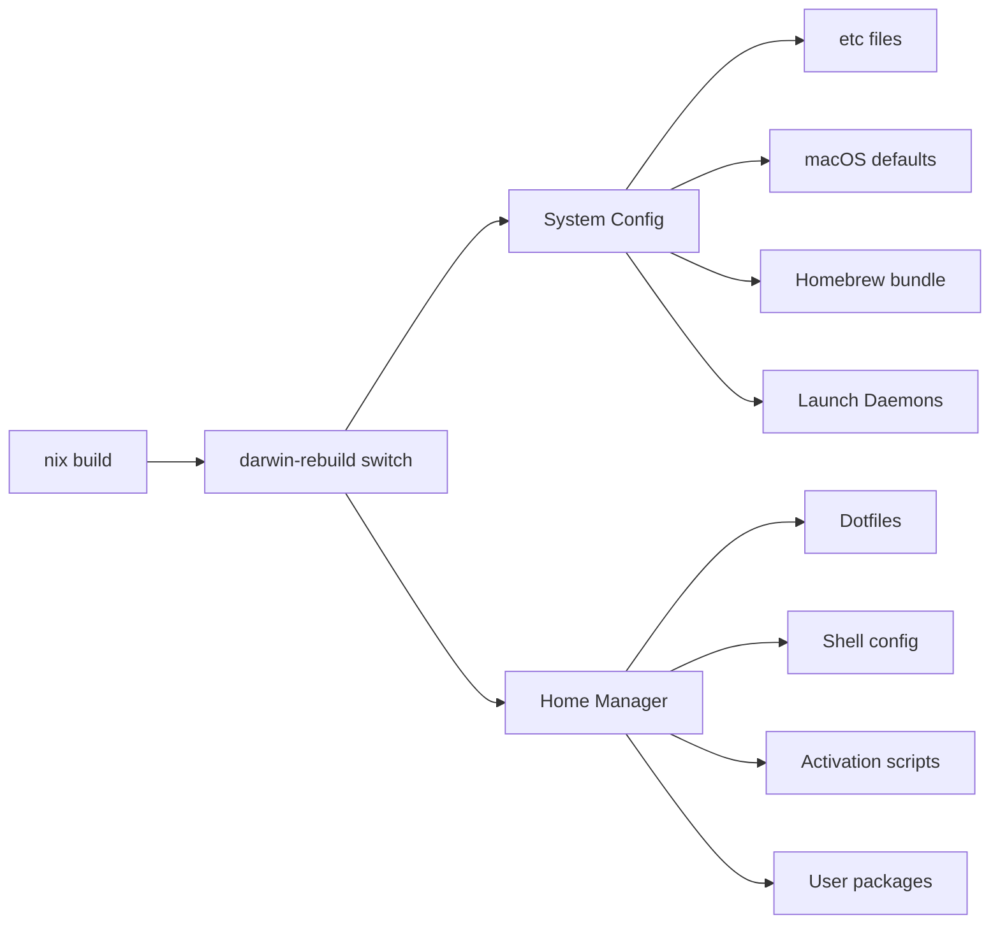

# Nix Darwin Configuration

macOS (aarch64-darwin) configuration using nix-darwin, home-manager, and nixvim.

## Module Dependency



## Build Flow



## Commands

```bash
just darwin        # Build and deploy configuration
just darwin-debug  # Deploy with verbose output
just fmt           # Format all .nix files
just up            # Update all flake inputs
just upp <input>   # Update specific flake input
just clean         # Remove generations older than 7 days
just gc            # Garbage collect unused nix store entries
just history       # View system profile generations
just repl          # Open Nix REPL
```
