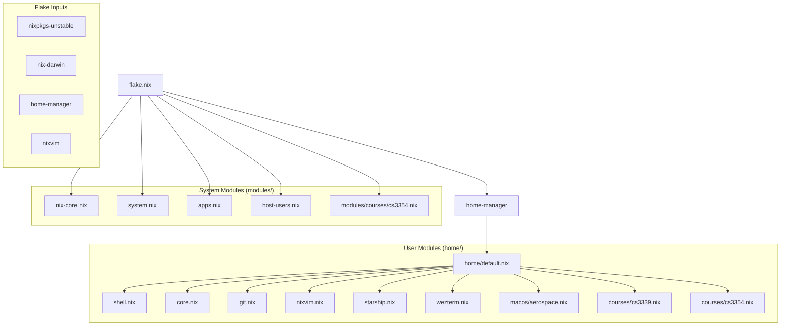

# Nix Darwin Configuration

macOS (aarch64-darwin) configuration using nix-darwin, home-manager, and nixvim.

## Module Dependency



## Build Flow

```mermaid
flowchart LR
    A[nix build] --> B[darwin-rebuild switch]
    B --> C[System Config]
    B --> D[Home Manager]

    C --> C1[/etc/ files]
    C --> C2[macOS defaults]
    C --> C3[Homebrew bundle]
    C --> C4[Launch Daemons]

    D --> D1[Dotfiles]
    D --> D2[Shell config]
    D --> D3[Activation scripts]
    D --> D4[User packages]
```

## Commands

```bash
just darwin        # Build and deploy configuration
just darwin-debug  # Deploy with verbose output
just fmt           # Format all .nix files
just up            # Update all flake inputs
just upp <input>   # Update specific flake input
just clean         # Remove generations older than 7 days
just gc            # Garbage collect unused nix store entries
just history       # View system profile generations
just repl          # Open Nix REPL
```
