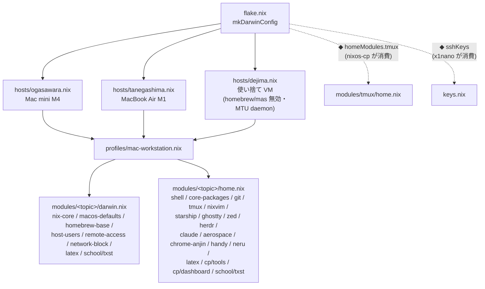
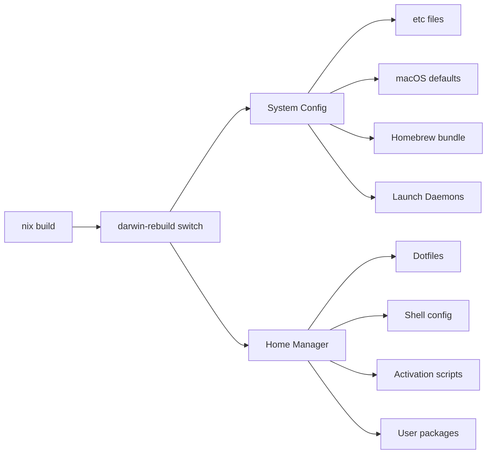

# Nix Darwin Configuration

macOS (aarch64-darwin) configuration using nix-darwin, home-manager, and nixvim.

## 構造（ドメイン軸ツリー）

```
flake.nix            入力宣言＋配線＋外部公開 output のみ
keys.nix             デバイス公開鍵台帳（◆ sshKeys として外部公開）
hosts/<name>.nix     機体 = 1台1ファイル。profile を import し、機体固有差分だけ書く
profiles/<role>.nix  役割 = トピックの束（システム層＋ユーザー層の配線）
modules/<topic>/     1 関心事 = 1 ディレクトリ。ファイル名が適用層を宣言する：
                       darwin.nix … nix-darwin（システム）層
                       home.nix   … home-manager（ユーザー）層
                       （将来 NixOS を足すなら nixos.nix を同じ部屋に足す）
                     スクリプト・アセットはトピックのディレクトリに同居させる
modules/_archive/    退役トピック。復帰は profile に import 1行
```

ルール：**新しい関心事 = modules/ に新しいディレクトリ**。ユーザー設定は
home.nix、システム設定は darwin.nix に書く。どのホストに入るかは
profiles/ が列挙し、機体固有の差分は hosts/ に書く。


```mermaid
graph TD
    flake["flake.nix<br/>mkDarwinConfig"] --> ogasawara["hosts/ogasawara.nix<br/>Mac mini M4"]
    flake --> tanegashima["hosts/tanegashima.nix<br/>MacBook Air M1"]
    flake --> dejima["hosts/dejima.nix<br/>使い捨て VM<br/>(homebrew/mas 無効・MTU daemon)"]

    ogasawara --> profile["profiles/mac-workstation.nix"]
    tanegashima --> profile
    dejima --> profile

    profile --> sys["modules/&lt;topic&gt;/darwin.nix<br/>nix-core / macos-defaults / homebrew-base /<br/>host-users / remote-access / network-block /<br/>latex / school/txst"]
    profile --> usr["modules/&lt;topic&gt;/home.nix<br/>shell / core-packages / git / tmux / nixvim /<br/>starship / ghostty / zed / herdr /<br/>claude / aerospace / chrome-anjin / handy / neru /<br/>latex / cp/tools / cp/dashboard / school/txst"]

    flake -. "◆ homeModules.tmux<br/>(nixos-cp が消費)" .-> tmux["modules/tmux/home.nix"]
    flake -. "◆ sshKeys<br/>(x1nano が消費)" .-> keys["keys.nix"]
```

## Build Flow


```mermaid
flowchart LR
    A[nix build] --> B[darwin-rebuild switch]
    B --> C[System Config]
    B --> D[Home Manager]

    C --> C1["etc files"]
    C --> C2["macOS defaults"]
    C --> C3[Homebrew bundle]
    C --> C4[Launch Daemons]

    D --> D1[Dotfiles]
    D --> D2[Shell config]
    D --> D3[Activation scripts]
    D --> D4[User packages]
```

## Commands

```bash
just darwin        # Build and deploy configuration
just darwin-debug  # Deploy with verbose output
just fmt           # Format all .nix files
just up            # Update all flake inputs
just upp <input>   # Update specific flake input
just clean         # Remove generations older than 7 days
just gc            # Garbage collect unused nix store entries
just history       # View system profile generations
just repl          # Open Nix REPL
```
